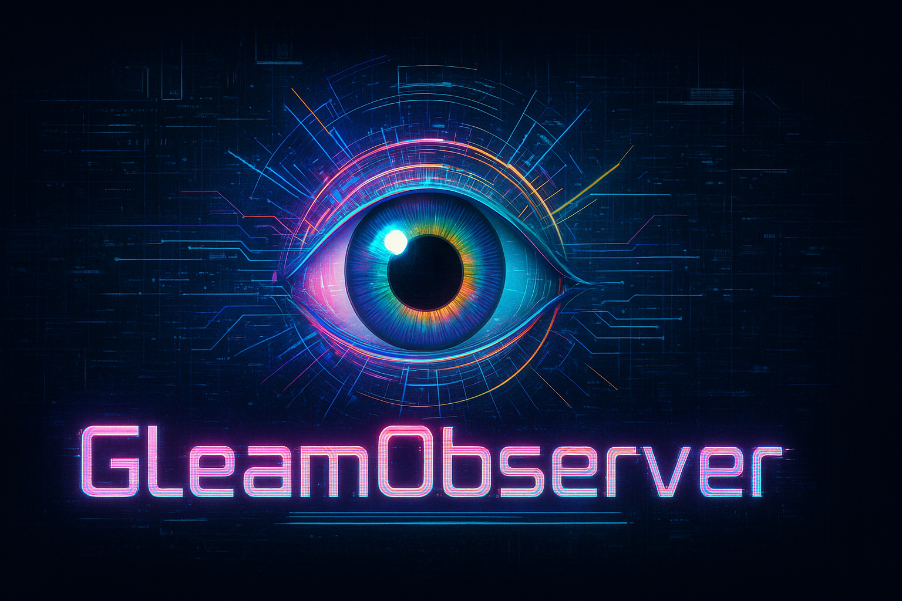

<div align="center">



<br>

### 🌌 A Universal Hardware Monitoring Tool with **Cyberpunk Aesthetic**

<p align="center">
  
  
  
  
</p>

<p align="center">
  
  
  
  
</p>

<h3>
  
  Catppuccin Mocha • Cyberpunk ASCII Art • Real-time Analytics • Multi-GPU Support
  
</h3>

> 💜 **Experience hardware monitoring like never before** - where functionality meets aesthetics in a terminal-based masterpiece.

<p align="center">
  <a href="#-features"><kbd> <br> ✨ Features <br> </kbd></a>
  <a href="#-installation"><kbd> <br> 📦 Installation <br> </kbd></a>
  <a href="#-usage"><kbd> <br> 🚀 Usage <br> </kbd></a>
  <a href="#-screenshots"><kbd> <br> 📸 Screenshots <br> </kbd></a>
  <a href="#️-configuration"><kbd> <br> ⚙️ Configuration <br> </kbd></a>
</p>

---

</div>

## 💡 Stop Settling for Basic Monitoring

<div align="center">

```
▓▒░ NEXT-GENERATION TERMINAL MONITORING ░▒▓
```

</div>

GleamObserver isn't just another resource monitor. It's the **future of terminal dashboards**—combining **cyberpunk aesthetics** with **professional-grade analytics** for developers and sysadmins who refuse to compromise.

Built with **Rust 🦀** for power users who demand both **style and substance**.

<div align="center">

```ascii
     ┌─────────────────────────────────────┐
     │  🌌 Catppuccin Mocha Theme          │
     │  ▓▒ Cyberpunk ASCII Art             │
     │  📊 Predictive Analytics            │
     │  🎮 130+ GPU Models Recognized      │
     │  ⚡ Single Binary • Zero Config     │
     └─────────────────────────────────────┘
```

</div>

### 🌌 Why GleamObserver Stands Out

<table>
<tr>
<td width="50%" valign="top">

#### 🎨 **Cyberpunk Aesthetic**
- **Catppuccin Mocha** color palette
- Custom **ASCII art branding**
- **Gradient progress bars** with block characters
- **Sparkline visualizations** for historical data
- **Color-coded indicators** (green → yellow → red)
- Terminal eye-candy that doesn't sacrifice functionality

</td>
<td width="50%" valign="top">

#### ⚡ **Professional Features**
- **130+ GPU database** with exact model detection
- **World's first** trend detection with forecasting
- **Real-time alerts** with desktop notifications
- **GPU process tracking** (NVIDIA only)
- **Power efficiency** calculations
- **CSV/JSON export** for data analysis

</td>
</tr>
</table>

### 🚀 Core Capabilities

- 🔍 **Deep Hardware Insights**: CPU per-core, GPU processes, power draw, clock speeds, fan RPM
- 🤖 **Predictive Analytics**: Linear regression forecasting with R² confidence scores
- 🌐 **Universal GPU Support**: NVIDIA (NVML), AMD (sysfs/hwmon), Intel Arc (basic)
- 📊 **Historical Tracking**: Sparklines, time-travel mode, configurable retention
- 🚨 **Smart Notifications**: Per-alert-type cooldown to prevent spam
- ⚡ **Zero Dependencies**: Single binary, no external libraries required

---

<div align="center">

## ✨ Features


</div>

### Core Monitoring
- **CPU**: Per-core usage with color-coded indicators and history
- **Memory**: RAM and SWAP usage with real-time gauges and percentage display
- **Processes**: Sort by CPU/Memory with kill/terminate capabilities
- **Disk I/O**: Read/write speeds and usage statistics
- **Network**: Real-time bandwidth monitoring

### GPU Monitoring (Multi-Vendor)
- **NVIDIA** (via NVML): Full support for GeForce/Quadro/Tesla
- **AMD** (via sysfs): Radeon RX 5000/6000/7000 series
- **Intel** (basic support): Arc and Iris Xe

**GPU Metrics:**
- Temperature with thermal throttling warnings
- Utilization percentage
- Memory usage (used/total)
- Power draw and efficiency (Watts/Watt)
- Core and memory clock speeds
- Fan speed (RPM and %)
- Per-process GPU usage (NVIDIA)

### 🎯 Unique Features

#### 1. Trend Detection & Predictive Analytics
**World's first system monitor with built-in forecasting!**
- Linear regression analysis (R² > 0.5 confidence)
- Predicts resource exhaustion time
- Detects rising/falling/stable trends
- Visual indicators (↗ ↘ →) with severity levels
- Forecasts: "CPU will reach 90% in 45 minutes"

#### 2. Known GPU Database
Stop seeing generic GPU names! GleamObserver includes a comprehensive database of:
- **130+ GPU models** with accurate naming
- **6 AMD brands**: Sapphire (Nitro), ASUS (ROG/TUF), MSI, Gigabyte, XFX, PowerColor
- **6 NVIDIA brands**: ASUS, MSI (Suprim X), Gigabyte (AORUS), EVGA, Zotac, PNY
- Fallback to system detection for unlisted models

#### 3. Smart Desktop Alerts
- Per-alert-type cooldown (no spam!)
- 6 alert types: CPU, Memory, GPU Temp, GPU Util, Disk, Network
- Native desktop notifications
- Configurable thresholds via TOML

#### 4. Historical Data Export
- CSV and JSON export formats
- Configurable retention (1-24 hours)
- Time-travel mode for analysis
- Perfect for performance debugging

---

## 🌙 Always-On Mode: Background Daemon + System Tray

**The Feature That Sets Us Apart:** GleamObserver is the **only hardware monitor** that runs as a persistent background service with system tray integration—like Discord, Steam, or OpenRGB.

### What Makes This Different from htop/btop?

<table>
<tr>
<th>Feature</th>
<th>htop</th>
<th>btop</th>
<th><b>GleamObserver</b></th>
</tr>
<tr>
<td><b>Execution Model</b></td>
<td>Terminal only</td>
<td>Terminal only</td>
<td>✅ <b>Persistent Daemon</b></td>
</tr>
<tr>
<td><b>Auto-start on Login</b></td>
<td>❌ Manual</td>
<td>❌ Manual</td>
<td>✅ <b>systemd Integration</b></td>
</tr>
<tr>
<td><b>System Tray Icon</b></td>
<td>❌</td>
<td>❌</td>
<td>✅ <b>Native Linux Systray</b></td>
</tr>
<tr>
<td><b>Desktop Notifications</b></td>
<td>❌</td>
<td>❌</td>
<td>✅ <b>Real-time Alerts</b></td>
</tr>
<tr>
<td><b>Background Monitoring</b></td>
<td>❌</td>
<td>❌</td>
<td>✅ <b>Always Watching</b></td>
</tr>
<tr>
<td><b>Package Manager Install</b></td>
<td>✅ Yes</td>
<td>✅ Yes</td>
<td>✅ <b>Multi-distro</b></td>
</tr>
</table>

### System Tray Features

```
GleamObserver 🌌
├─ 📊 Dashboard       → Opens full TUI
├─ 📈 Show Status     → CPU/MEM notification
├─ ⏸️ Pause Alerts    → Toggle notifications
├─ ⚙️ Settings        → Opens config.toml
└─ ❌ Exit            → Graceful shutdown
```

### Installation as Service

**One-Line Universal Install:**
```bash
git clone https://github.com/ind4skylivey/Gleam-Observer.git
cd Gleam-Observer
./install.sh
```

This automatically:
- ✅ Detects your distro (Arch, Ubuntu, Fedora, openSUSE)
- ✅ Installs dependencies
- ✅ Builds with optimized flags
- ✅ Creates systemd user service
- ✅ Sets up auto-start on login
- ✅ Installs icon and desktop entry

**Package Manager Install:**

```bash
# Arch Linux / Manjaro / EndeavourOS
yay -S gleam-observer

# AUR link
# https://aur.archlinux.org/packages/gleam-observer
```

> **💡 Primary Usage: TUI Monitor**  
> GleamObserver is a powerful **TUI (Terminal UI) monitor**, perfect for window managers like DWM, i3, Awesome.  
> Launch with `gleam` command or add a keybinding to your WM.
>
> **⚠️ System Tray Status:**  
> System tray daemon is **experimental** and only works on GNOME/KDE/XFCE.  
> Not compatible with DWM, i3, Awesome without additional configuration.  
> **Recommended:** Use TUI instead of system tray for window managers.

### Window Manager Setup (Recommended)

Add a keybinding to quickly launch GleamObserver:

**DWM (config.h):**
```c
{ MODKEY, XK_g, spawn, SHCMD("alacritty -e gleam") },
```

**i3 (config):**
```
bindsym $mod+g exec alacritty -e gleam
```

**Awesome (rc.lua):**
```lua
awful.key({ modkey }, "g", function() awful.spawn("alacritty -e gleam") end),
```

**bspwm (sxhkdrc):**
```
super + g
    alacritty -e gleam
```

### Why Choose TUI

**Traditional tools (htop/btop):** Basic monitoring  
**GleamObserver:** Cyberpunk aesthetics + advanced analytics

Perfect for:
- 🎮 Window manager users (DWM, i3, Awesome)
- 💻 Developers who love terminal workflow
- 🖥️ System admins monitoring multiple machines
- 🔬 Power users who want detailed GPU metrics

---

## 📦 Installation

### System Requirements

#### Required Dependencies
| Component | Minimum Version | Installation |
|-----------|----------------|--------------|
| **Rust** | 1.70+ | `curl --proto '=https' --tlsv1.2 -sSf https://sh.rustup.rs \| sh` |
| **Linux Kernel** | 4.0+ | Pre-installed on most distributions |
| **Terminal** | Any modern terminal | xterm, gnome-terminal, konsole, alacritty, etc. |

#### Optional Dependencies (GPU Support)

**NVIDIA GPUs:**
```bash
# Check if NVIDIA driver is installed
nvidia-smi

# If not installed:
# Arch Linux
sudo pacman -S nvidia nvidia-utils

# Ubuntu/Debian
sudo apt install nvidia-driver-535 nvidia-utils-535

# Fedora
sudo dnf install akmod-nvidia
```

**AMD GPUs:**
```bash
# Check if amdgpu driver is loaded
lsmod | grep amdgpu

# Usually pre-installed on kernel 5.0+
# If issues occur:
# Arch Linux
sudo pacman -S mesa lib32-mesa vulkan-radeon

# Ubuntu/Debian  
sudo apt install mesa-vulkan-drivers libdrm-amdgpu1

# Fedora
sudo dnf install mesa-dri-drivers mesa-vulkan-drivers
```

**Desktop Notifications:**
```bash
# Check if notify-send is available
which notify-send

# If not installed:
# Arch Linux
sudo pacman -S libnotify

# Ubuntu/Debian
sudo apt install libnotify-bin

# Fedora
sudo dnf install libnotify
```

### Option 1: Pre-compiled Binary (Easiest)

**Download the latest release:**

```bash
# Download and extract v1.5.2
wget https://github.com/ind4skylivey/Gleam-Observer/releases/download/v1.5.2/gleam-observer-v1.5.2-linux-x86_64.tar.gz
tar -xzf gleam-observer-v1.5.2-linux-x86_64.tar.gz

# Install to system
sudo mv gleam /usr/local/bin/
sudo mv gleam-tray /usr/local/bin/

# Run TUI
gleam

# Or start daemon with systray
systemctl --user enable --now gleam-observer
```

**Or use the automated installer:**

```bash
# Download and run installer
curl -sSL https://raw.githubusercontent.com/ind4skylivey/Gleam-Observer/master/install.sh | bash
```

### Option 2: Build from Source

```bash
git clone https://github.com/ind4skylivey/Gleam-Observer.git
cd Gleam-Observer
chmod +x install.sh
./install.sh
```

The installer will:
- Check system dependencies
- Detect GPU drivers automatically
- Build the release binary
- Install to `~/.local/bin/gleam`
- Create desktop application entry
- Verify installation

### Manual Build
```bash
# Clone repository
git clone git@github.com:ind4skylivey/Gleam-Observer.git
cd Gleam-Observer

# Build with all features (including systray)
cargo build --release --features nvidia,amd,intel,systray

# Run directly
./target/release/gleam

# Or install manually
sudo cp target/release/gleam /usr/local/bin/gleam
sudo cp target/release/gleam-tray /usr/local/bin/gleam-tray
```

### Feature Flags
```bash
# NVIDIA only (no systray)
cargo build --release --features nvidia

# AMD only (no systray)
cargo build --release --features amd

# All GPU vendors with systray
cargo build --release --features nvidia,amd,intel,systray

# No GPU support (CPU/RAM/Processes only, no systray)
cargo build --release --no-default-features
```

---

## 🚀 Usage

### Basic Commands
```bash
# Launch monitor
gleam

# Show help
gleam --help

# Show version
gleam --version
```

### ⌨️ Keyboard Shortcuts

<div align="center">

**Master GleamObserver with these intuitive keybindings**

</div>

#### 🎮 Navigation & Views

<table>
<tr>
<td width="50%" valign="top">

**General Navigation**
| Key | Action |
|-----|--------|
| `q` | Quit GleamObserver |
| `Tab` | Switch between views (Dashboard → Processes → History) |
| `h` | Toggle History mode |
| `p` / `Space` | Pause/Resume updates |
| `Esc` | Close dialogs / Return to main view |

</td>
<td width="50%" valign="top">

**Process List Navigation**
| Key | Action |
|-----|--------|
| `↑` / `↓` | Navigate up/down process list |
| `Page Up` / `Page Down` | Fast scroll |
| `Home` | Jump to first process |
| `End` | Jump to last process |

</td>
</tr>
</table>

---

#### 🌳 Process Tree View (NEW!)

<table>
<tr>
<td width="100%">

| Key | Action | Description |
|-----|--------|-------------|
| `t` | **Toggle Tree View** | Switch between flat list and hierarchical tree |
| `←` | **Collapse Node** | Collapse selected process and hide its children |
| `→` | **Expand Node** | Expand selected process to show children |
| Tree indicators: | `▼` = Expanded | `▶` = Collapsed |

**Visual Example:**
```
systemd [PID: 1] CPU: 0.1% MEM: 0.5%
├▼ nginx [PID: 1234] CPU: 5.2% (+ 12.3% children)
│ ├─ nginx worker [PID: 1235] CPU: 4.1%
│ ├─ nginx worker [PID: 1236] CPU: 4.0%
│ └─ nginx worker [PID: 1237] CPU: 4.2%
├▶ chrome [PID: 2000] CPU: 45.3% (collapsed, 15 children hidden)
└─ sshd [PID: 890] CPU: 0.0%
```

</td>
</tr>
</table>

---

#### 🔍 Live Filter (NEW!)

<table>
<tr>
<td width="100%">

| Key | Action | Description |
|-----|--------|-------------|
| `/` | **Enter Filter Mode** | Start typing to filter processes in real-time |
| `Backspace` | Remove last character | Edit your search |
| `Esc` | **Clear Filter** | Exit filter mode and show all processes |
| `Enter` | Accept filter | Keep filter active and exit input mode |

**How it works:**
- Type any part of: **process name**, **command**, or **PID**
- Filter updates **instantly** as you type
- Shows match count: `(23 matches)`
- **Case-insensitive** search

**Example:**
```
Filter: chrom_
(5 matches)

Showing:
- chrome [PID: 2000]
- chrome_crashpad [PID: 2001]
- chrome worker [PID: 2010]
...
```

</td>
</tr>
</table>

---

#### ⚔️ Process Management & Signals (NEW!)

<table>
<tr>
<td width="100%">

| Key | Signal | Behavior | Use Case |
|-----|--------|----------|----------|
| `k` | **Smart Kill** 🧠 | SIGTERM → wait 3s → SIGKILL if alive | **Recommended**: Graceful with fallback |
| `K` | **Force Kill** ⚡ | Immediate SIGKILL | Unresponsive processes |
| `T` | **Terminate** 🛑 | SIGTERM only | Clean shutdown |
| `i` | **Process Info** ℹ️ | Show detailed process information | Inspect before acting |

**Smart Kill Workflow:**
```
1. Press 'k' on selected process
   ├─ Sends SIGTERM (graceful shutdown)
   ├─ Status: "Sent SIGTERM to nginx (1234), waiting..."
   └─ Waits 3 seconds

2. Process check:
   ├─ ✓ Terminated gracefully → Success!
   └─ ✗ Still alive → Auto-escalate to SIGKILL
       └─ Status: "Process 1234 terminated (escalated to SIGKILL)"
```

**Key differences:**
- `k` = **Smart** (tries gentle first, force if needed) ← **Recommended**
- `K` = **Instant** (no mercy, immediate termination)
- `T` = **Polite** (asks nicely, accepts "no" as answer)

</td>
</tr>
</table>

---

#### 📊 Sorting & Organization

| Key | Sort By | Order |
|-----|---------|-------|
| `s` | Cycle sort mode | CPU → Memory → Name → PID |
| `c` | Sort by CPU usage | Descending (highest first) |
| `m` | Sort by Memory usage | Descending (highest first) |

---

#### 🎨 Quick Reference Card

<div align="center">

```
╔══════════════════════════════════════════════════════════════════╗
║                    GLEAMOBSERVER KEYBINDINGS                     ║
╠══════════════════════════════════════════════════════════════════╣
║  NAVIGATION          │  TREE VIEW           │  PROCESS CONTROL  ║
║  q     Quit          │  t    Toggle tree    │  k    Smart kill  ║
║  Tab   Switch view   │  ←    Collapse       │  K    Force kill  ║
║  h     History       │  →    Expand         │  T    Terminate   ║
║  p     Pause         │                      │  i    Info        ║
║  ↑↓    Navigate      │  FILTER              │                   ║
║                      │  /    Search         │  SORT             ║
║                      │  Esc  Clear          │  s    Cycle sort  ║
║                      │                      │  c    By CPU      ║
║                      │                      │  m    By Memory   ║
╚══════════════════════════════════════════════════════════════════╝
```

</div>

### Views

#### 🏠 Dashboard View
- Real-time metrics for CPU, RAM, SWAP, GPU
- System information with ASCII art logo
- Active trends panel with predictions
- Color-coded alerts

#### 📊 Processes View
- Sortable process table
- Full command display
- Interactive kill/terminate
- CPU and memory usage per process

#### 📈 History View
- Historical charts and sparklines
- Export data (CSV/JSON)
- Time-travel mode
- Trend analysis

---

## ⚙️ Configuration

Configuration file: `~/.config/gleam_observer/config.toml`

```toml
[general]
update_interval = 1000  # milliseconds
theme = "catppuccin"

[alerts]
enabled = true
cooldown = 60  # seconds between same alert type

[alerts.thresholds]
cpu_percent = 80.0
memory_percent = 85.0
gpu_temp = 85.0
gpu_util = 95.0
disk_usage_percent = 90.0
network_mbps = 100.0

[history]
enabled = true
max_entries = 3600  # 1 hour at 1s interval
retention_hours = 1

[trends]
enabled = true
min_confidence = 0.5  # R² threshold
show_stable_trends = true

[gpu]
nvidia_enabled = true
amd_enabled = true
intel_enabled = true
```

---

## 📸 Screenshots

<div align="center">

### 🎨 **Dashboard View** - Cyberpunk Aesthetic in Action

</div>

```
  ◆ GleamObserver ◆  Universal Hardware Monitor

╭─ CPU ────────────────────────────────────────────────────────────╮
│ ████████████████████████░░░ 75.3%                                 │
│ AMD Ryzen 9 7950X3D • 16 Cores / 32 Threads • 5.7 GHz            │
│ History                                                          │
│ ▁▂▃▄▅▆▇█▇▆▅▄▃▂▁▂▃▄▅▆▇█▇▆▅▄▃▂▁▂▃▄▅▆▇█▇▆▅▄▃▂▁▂▃▄▅▆▇█▇▆▅▄▃      │
╰──────────────────────────────────────────────────────────────────╯

╭─ RAM ──────────────────────────╮  ╭─ SWAP ───────────────────────╮
│ ██████████████░░░░░░ 48.2%     │  │ ██░░░░░░░░░░░░░░░░░░ 8.5%     │
│ 30.9 GB / 64.0 GB              │  │ 4.3 GB / 50.0 GB             │
│ Mem History                    │  │                              │
│ ▃▄▅▅▆▆▇▇▆▅▄▃▃▄▅▆▇█▇▆▅          │  │ ▁▁▁▁▁▂▂▂▂▂▁▁▁▁▁▁▁▁        │
╰────────────────────────────────╯  ╰──────────────────────────────╯

╭─ GPU ──────────────────────────────────────┬─ System Info ────────────╮
│ ◆ GPU 0 AMD                                │   ▓▒▓▒▓ ▓▒▓▒▓ ▓▒▓      │
│ Sapphire NITRO+ Radeon RX 7900 XTX Vapor-X│ ◆ Gleam0bserver         │
│   ├─ Temp: 68.0°C  Usage: 87.3%           │                          │
│   ├─ Memory: 18432 MB / 24576 MB (75.0%)  │ 🖥️  BATTLESTATION-ZERO   │
│   ├─ Power: 355W / 450W                   │ 🐧 Arch Linux            │
│   ├─ Efficiency: 0.25%/W                  │ ⚙️  Kernel 6.11.5-zen1   │
│   ├─ Core: 2680MHz  Memory: 2500MHz       │ 📊 CPU: 32 Threads       │
│   ├─ Fan: 2847 RPM (68%)                  │ 🔢 Processes: 347        │
│   └─ GPU Processes:                        │ ⏱️  Uptime: 8d 14h 32m  │
│       • blender (PID: 15234) - 8.2 GB     │                          │
│       • davinci (PID: 18821) - 6.4 GB     │                          │
╰────────────────────────────────────────────┴──────────────────────────╯

╭─ Trends ─────────────────────────────────────────────────────────────╮
│ ↗ GPU Memory trending up (R²: 0.89) - will reach 90% in ~23 minutes │
│ → CPU stable at 75% (R²: 0.15)                                       │
│ ↘ System RAM decreasing (R²: 0.67) - freeing memory                 │
╰──────────────────────────────────────────────────────────────────────╯

[q] Quit | [Tab] Processes | [h] History | [p] Pause | ▶ RUNNING
```

<div align="center">

*High-end workstation setup: AMD Ryzen 9 7950X3D • 64GB DDR5 • Sapphire NITRO+ Radeon RX 7900 XTX Vapor-X*

**Featuring Catppuccin Mocha theme with cyberpunk ASCII art**

</div>

---

## 🛠️ Development

### Project Structure
```
GleamObserver/
├── src/
│   ├── main.rs           # Entry point
│   ├── app.rs            # Application state
│   ├── config.rs         # Configuration management
│   ├── metrics/          # System metrics collection
│   ├── gpu/              # Multi-vendor GPU backends
│   │   ├── nvidia.rs     # NVML wrapper
│   │   ├── amd.rs        # sysfs/hwmon reader
│   │   └── intel.rs      # Intel Arc support
│   ├── tui/              # Terminal UI components
│   ├── alerts/           # Alert system
│   ├── history/          # Historical data storage
│   └── trends/           # Predictive analytics
├── config/
│   └── default.toml      # Default configuration
└── install.sh            # Installation script
```

### Building from Source
```bash
# Development build
cargo build

# Release build with optimizations
cargo build --release

# Run tests
cargo test

# Run with logging
RUST_LOG=debug cargo run
```

### Roadmap

**To-Do:**
- [ ] Intel Arc GPU full implementation
- [ ] Container awareness (Docker/K8s)
- [ ] Per-process network bandwidth
- [ ] Benchmarking mode
- [ ] More GPU model mappings
- [ ] Translations

---

## 📋 Requirements

### Minimum System Requirements
- **OS**: Linux (kernel 4.0+)
- **RAM**: 10 MB
- **Terminal**: Any modern terminal emulator with Unicode support

### GPU Support Requirements

| Vendor | Requirements |
|--------|--------------|
| **NVIDIA** | Driver 450+ • CUDA 11+ • NVML library |
| **AMD** | Kernel 5.0+ • amdgpu driver • sysfs access |
| **Intel** | Kernel 5.10+ • i915/xe driver (basic support) |

---

## 🐛 Troubleshooting

### GPU not detected
```bash
# NVIDIA: Check NVML
nvidia-smi

# AMD: Check sysfs
ls /sys/class/drm/card*/device/hwmon/

# Permissions
sudo usermod -a -G video $USER
```

### Binary not found after install
```bash
# Add to PATH (bash)
echo 'export PATH="$HOME/.local/bin:$PATH"' >> ~/.bashrc
source ~/.bashrc

# Add to PATH (zsh)
echo 'export PATH="$HOME/.local/bin:$PATH"' >> ~/.zshrc
source ~/.zshrc
```

### Desktop notifications not working
```bash
# Install notification daemon
sudo pacman -S dunst  # Arch
sudo apt install dunst  # Debian/Ubuntu
```

---

## 🗺️ Roadmap - Future Platform Support

<div align="center">

### 🔮 Coming Soon to More Platforms

<table>
<tr>
<td width="33%" align="center">

#### 🍎 **macOS**
**Planned for v2.0**

✨ Features:
- Metal API for GPU monitoring
- Apple Silicon (M1/M2/M3) support
- Intel Mac support
- Native notifications
- Homebrew installation

🔧 Implementation:
- IOKit framework integration
- Activity Monitor API
- Metal performance shaders
- Unified memory monitoring

</td>
<td width="33%" align="center">

#### 🪟 **Windows**
**Planned for v2.5**

✨ Features:
- DirectX GPU monitoring
- WMI/Performance Counters
- Task Manager integration
- Windows notifications
- MSI Afterburner compatibility

🔧 Implementation:
- Windows API (Win32)
- D3D/DXGI for GPU stats
- Performance Data Helper (PDH)
- Event Tracing for Windows (ETW)

</td>
<td width="33%" align="center">

#### 🐧 **Linux**
**Currently Supported ✅**

✨ Features:
- NVIDIA (NVML)
- AMD (sysfs/hwmon)
- Intel Arc (basic)
- 130+ GPU database
- Full feature set

🎯 Already includes:
- Trend detection
- Desktop notifications
- Process management
- Historical tracking

</td>
</tr>
</table>

### 📅 Development Timeline

```
Q4 2024 ━━━━━━━━━━━━━━━━━━━━━━━ v1.0.0 Linux Release ✅
Q1 2025 ━━━━━━━━━━━━━━━━━━━━━━━ v2.0.0 macOS Support (planned)
Q2 2026 ━━━━━━━━━━━━━━━━━━━━━━━ v2.5.0 Windows Support (planned)
Q3 2026 ━━━━━━━━━━━━━━━━━━━━━━━ v3.0.0 Cross-platform Unification
```

### 💡 Why Linux First?

GleamObserver started on Linux because:
- **Best GPU support** via direct kernel access (sysfs, NVML)
- **Native UNIX tools** for system monitoring
- **Developer-focused** platform for initial testing
- **Open ecosystem** for hardware access

macOS and Windows support will bring the same cyberpunk aesthetic and professional features to all platforms!

</div>

---

## 📜 License & Copyright

**Copyright © 2024 ind4skylivey. All Rights Reserved.**

This software is dual-licensed for **personal use only**:
- MIT License ([LICENSE-MIT](LICENSE-MIT))
- Apache License 2.0 ([LICENSE-APACHE](LICENSE-APACHE))

### ⚠️ Usage Restrictions

**PERMITTED:**
- ✅ Personal use and installation
- ✅ Modifying for personal use only
- ✅ Reporting bugs and issues
- ✅ Sharing the official repository link

**PROHIBITED:**
- ❌ Commercial use without written permission
- ❌ Redistribution of modified versions
- ❌ Forking for public distribution
- ❌ Copying code to other projects
- ❌ Creating derivative works for distribution
- ❌ Removing copyright notices

This is a **unique project** created and maintained exclusively by ind4skylivey. Unauthorized copying, modification for redistribution, or commercial use is strictly prohibited.

For commercial licensing inquiries, contact the author.

---

## 🙏 Acknowledgments

- **ratatui** - Terminal UI framework
- **sysinfo** - Cross-platform system information
- **nvml-wrapper** - NVIDIA Management Library bindings
- **Catppuccin** - Beautiful color palette

---

## 📬 Contact

- **Author**: [ind4skylivey](https://github.com/ind4skylivey)
- **Repository**: [Gleam-Observer](https://github.com/ind4skylivey/Gleam-Observer)
- **Issues**: [Report a bug](https://github.com/ind4skylivey/Gleam-Observer/issues)

---

<div align="center">


<br>


### Made with 💜 and Rust 🦀

<p align="center">
  
  
  
</p>

**[⬆ Back to Top](#gleamobserver)**

---

<h3>
  
  If you like this project, please consider giving it a ⭐!
  
</h3>

<sub>© 2024 ind4skylivey • All Rights Reserved • Personal Use Only</sub>

<br><br>

```
▓▒░ COPYRIGHT PROTECTED ░▒▓
Unauthorized copying, redistribution, or commercial use is strictly prohibited
```

</div>
